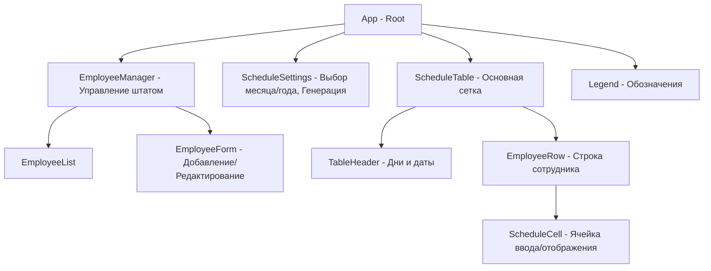

# Архитектура приложения Shift Scheduler

Данный документ описывает структуру данных и архитектуру компонентов приложения для составления
графиков смен.

## 1. Структура данных

### 1.1. Отделы (Departments)

Приложение поддерживает два отдела:

- `STACJA` (Станция)
- `WBC` (Wild Bean Cafe)

### 1.2. Сотрудник (Employee)

```typescript
interface Employee {
  id: string; // Уникальный идентификатор (UUID)
  firstName: string; // Имя
  lastName: string; // Фамилия
  department: string; // 'Stacja' | 'Wild Bean Cafe'
  noSaturdays: boolean; // Флаг "Не работает по субботам"
}
```

### 1.3. График (Schedule)

Данные графика хранятся в виде объекта, где ключом является идентификатор месяца (например,
`2024-05`), а значением — карта смен сотрудников.

```typescript
interface Schedule {
  [monthId: string]: {
    [employeeId: string]: {
      [day: number]: string; // '7-19', '19-7', '0' (выходной), 'U' (отпуск)
    };
  };
}
```

## 2. Иерархия компонентов



### Описание компонентов:

- **App**: Хранит основное состояние (employees, schedules), отвечает за загрузку/сохранение в
  `localStorage`.
- **EmployeeManager**: Контейнер для работы со списком сотрудников.
- **ScheduleSettings**: Позволяет выбирать текущий месяц/год и инициировать генератор.
- **ScheduleTable**: Отображает матрицу сотрудников и дней месяца.
- **ScheduleCell**: Поддерживает редактирование (ручной ввод '0' или 'U') и отображение
  сгенерированных смен.
- **Legend**: Справочная информация по сокращениям в таблице.

## 3. Логика и ограничения

### Генерация смен

Алгоритм должен учитывать:

1.  **Ручные вводы**: '0' и 'U' имеют приоритет.
2.  **Субботы**: Если у сотрудника `noSaturdays: true`, смены (7-19, 19-7) на субботу ему не
    назначаются.
3.  **Равномерное распределение**: Смены должны распределяться максимально поровну между доступными
    сотрудниками отдела.
4.  **Типы смен**: 7-19 (дневная), 19-7 (ночная).

### Хранение

Все данные сохраняются в `localStorage` при каждом изменении. При загрузке приложения данные
восстанавливаются.

### Печать

Реализуется через CSS медиа-запросы `@media print`, скрывая элементы управления (формы, кнопки) и
оставляя только таблицу графика.
